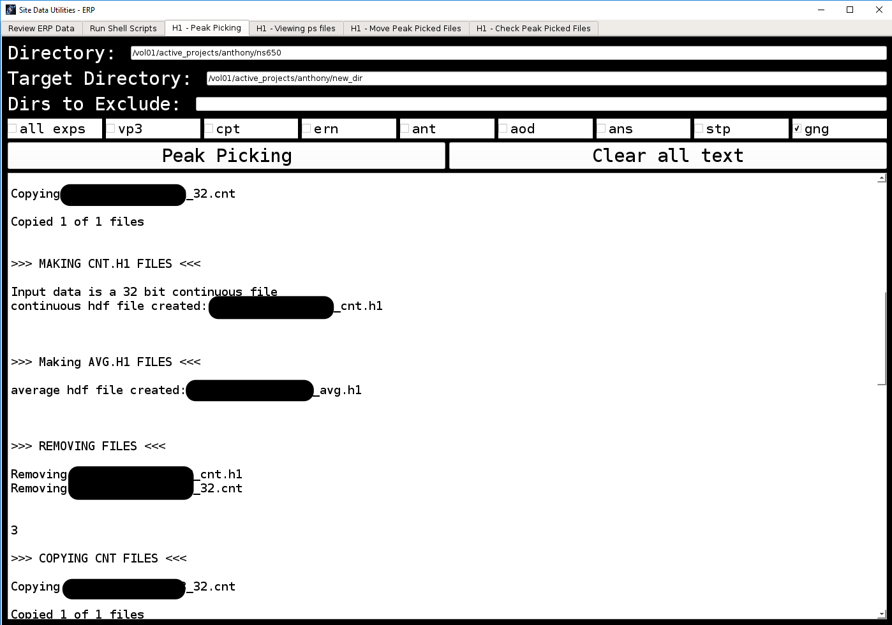
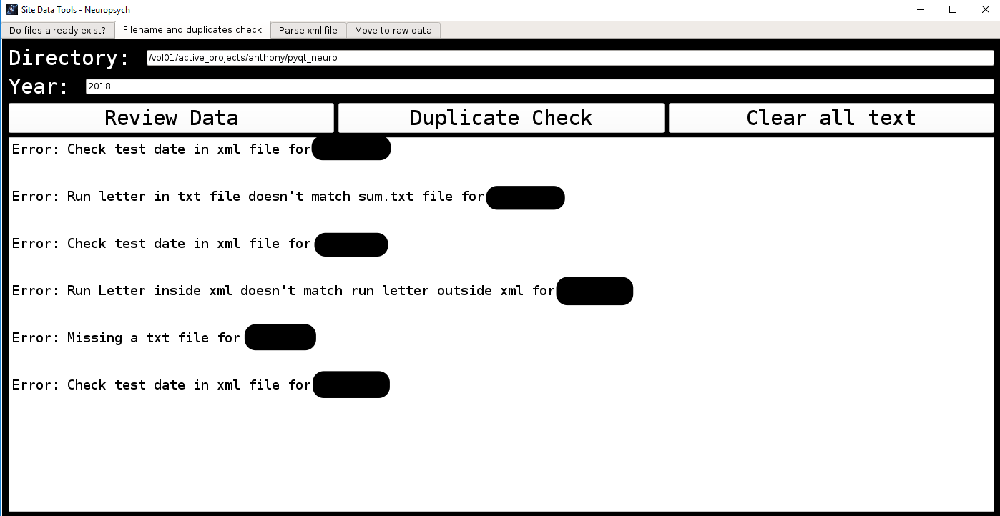

[HBNL](http://www.downstate.edu/hbnl/) Interactive GUI 
======

> Graphical User Interface developed using [PyQt5](https://riverbankcomputing.com/software/pyqt/intro) & logic consists of several classes with helper methods to identify errors, correct errors, run shell scripts, provide statistical summaries, and more.  

> Allows for batch processing of incoming [Event-Related Potential](https://www.semanticscholar.org/paper/Event-Related-Potentials-and-Language-Processing%3A-A-Kaan/c878f620aafda94fb7f6bfa1e6dfc44fdc91d416/figure/0) & [neuropsychological](https://en.wikipedia.org/wiki/Neuropsychology) data by allowing non-programmers to input directory paths leading to subject folders of aforementioned research data.  

> GUI features error handling, date/time/user logs of any data reviewed, & is run from a shell script activating a virtual environment.      

## ERP GUI
### Example 1

## #Example 2

## Neuropsych GUI 
### Example 1  

### Example 2  

